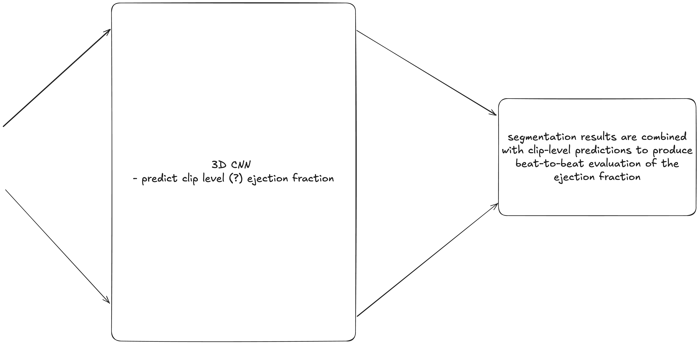

# Video-based AI for beat-to-beat assessment of cardiac function

### My Summary

### Questions

What is the significance of `mean absolute error` of 4.1% (training set) 6$% (external set)
> i think the importance of this is the model remains performant even with a new external set. this means no over / underfitting, no need for tuning 

What is the significance of `area under the curve of 0.96%`
>  AUC represents how well model can classify cardiomyopathy ... same importance as above, extremely accurate for all sets ... no need to tune

How is inter-observer variation beign measured?
> unsure, i dont think its measured but i did find [intra class correlation](https://en.wikipedia.org/wiki/Intraclass_correlation) and [Bland-Altman plots](https://en.wikipedia.org/wiki/Bland%E2%80%93Altman_plot)

### Vocab

| Word            | Definition |
|-----------------|-----------------|
| [inter-observer variability](https://www.wisdomlib.org/concept/interobserver-variability) | variation in metrics by two different observers (subjectivity) |
| [mean absolute error](https://en.wikipedia.org/wiki/Mean_absolute_error) | measures  average <u>magnitude</u> of errors in a set of predictions | 
| [ejection fraction](https://en.wikipedia.org/wiki/Ejection_fraction) | amount of blood left ventricle pumps out with each contraction |
| [dice similarity coefficient](https://en.wikipedia.org/wiki/Dice-S%C3%B8rensen_coefficient) | metric for comparing set similary |
| [inter-modality discordance]() | mismatch in results from different data sources |

